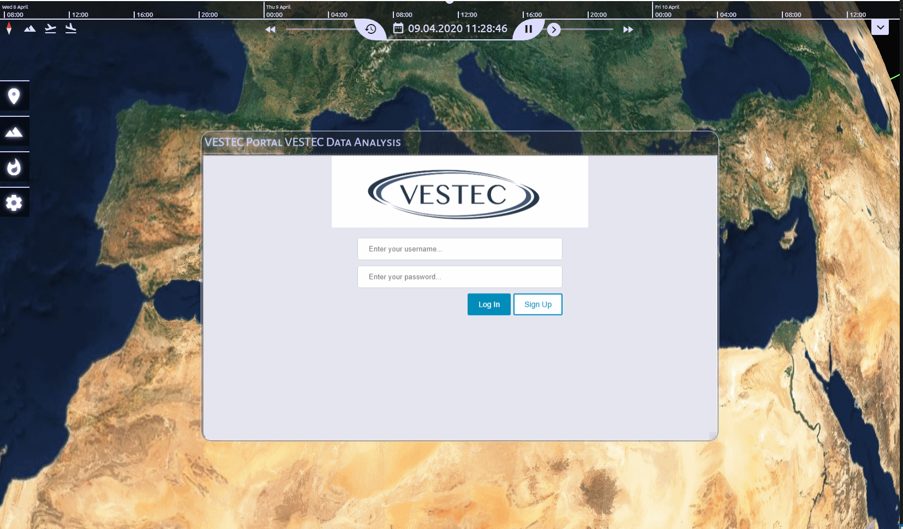
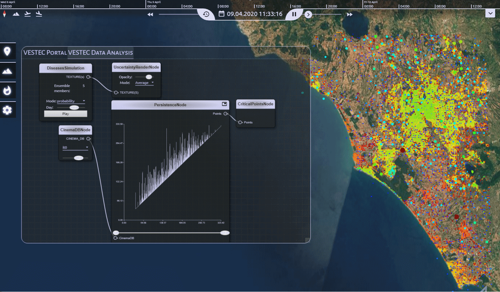
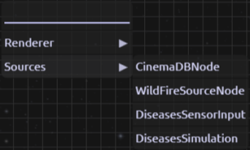

# csp-vestec
This plugin for CosmoScout VR provides functionalities for urgent decision making using the VESTEC framework. The framework is developed under the VESTEC  - H2020 - EU project and is about emerging use modes for High Performance Computing (HPC). You can find more detailed information about VESTEC on the project website:  
www.vestec-project.eu

Note: Just clone the "feature/vestec" branch on the CosmoScout VR repository. This plugin is included as git submodule.

## CosmoScout VR - Build Instructions
[Build - Documentation](docs%2Fsubpages%2Fbuild.md)

## Plugin Description


The plugin allows end-users registered to the VESTEC service system (see above image), to kick-off pre-defined workflows on an HPC machine and to analyze the result data in CosmoScout VR using the Node Editor shown in the next image. 



The node editor currently has two kind of node types. The source nodes providing the result data to be analyzed and the render nodes, visualizing the output of the source nodes.

The following node types are implemented:
* Source Nodes:
    * **WildfireSourceNode**: Currently reads the Wildfire Analyst result data, which can be downloaded using the portal tab. The output provides different kind of geo-referenced textures whcih can be visualized using the **TextureRenderNode**
    * **CinemaDBNode**: Reads the persistence diagrams stored in a Cinema database. The cinema database can be downloaded using the portal tab. The output can be visualized using the **PersistenceRenderNode**
    * **DiseasesSensorInput**: Reads the sensor input data (geo-referenced textures) used by the diseases simulation code. Output can be visualized using the **TextureRenderNode**
    * **DiseasesSimulation**: Reads the simulation ensemble data from the diseases simulation. The output can be visualized using the **UncertaintyRenderNode**
    * **TransferFunctionSourceNode**: Allows creating a transfer function that can be used by the **TextureRenderNode**, **CriticalPointsNode** and **UncertaintyRenderNode** to control the visualization of the data
* Render Nodes:
    * **PersistenceRenderNode**: Renders the persistence diagrams. User can specifiy minimum and maximum persistence values and directly brush data in the diagram. The output can be visualized using the **CriticalPointsNode**
    * **TextureRenderNode**: Simply renders the geo-referenced textures
    * **CriticalPointsNode**: Renders the critical points from the **PersistenceRenderNode**
    * **UncertaintyRenderNode**: Does uncertainty visualization using the output of the **DiseasesSimulation** node. Computes per pixel averages, variances, and differences using an OpenGL compute shader. This values are passed to a fragment shader and are used for color coding using a simple heat map. Users can select the visualization mode. A transfer function can be set seperately for the average values and for the variance and difference values.

## Integration of data for the analysis

Before using the node editor for data analysis, the path to the topological data and simulation results needs to be configured. This information is encoded in the CosmoScout VRs JSON configuration file which is placed under the “share/config/” folder and is called vestec.json. This file is read at the start-up of CosmoScout VR and contains a section for each plugin. The current “csp-vestec” section look as follows: 

```json
"csp-vestec": 
{
      "vestec-topo-dir": "../share/vestec/data/fbk_pdiags_R0.cdb",
      "vestec-fire-dir": "../share/vestec/data/wildfire",
      "vestec-diseases-dir": "../share/vestec/data/diseases"
}
```
The “vestec-topo-dir” defines the path to a folder where the cinema database containing the persistence diagrams is stored. The “vestec-fire-dir” is used to configure the input for the forest fire use case, produced by Wildfire Analyst and the “vestec-diseases-dir” defines the path the output of the mosquito borne diseases data products. All this data can be downloaded using the VESTEC portal. The data must then be placed into those directories. This configuration is only required for the current prototype. The access and integration of result data will be revised in the future. CosmoScout VR will integrate and exploit the REST API defined by WP5 directly to retrieve data. 

## Setup the data analysis pipeline to visualize persistence diagrams

| Description | Figure |
|----------|----------|
| This section explains how the end-users can start analyzing the topological data using the integrated editor in CosmoScout VR. The menu to create nodes can be opened by clicking the left mouse button. The menu depicted in the right figure will then pop-up. Using that menu the users are now able to create and connect the following node types to visualize and interact with the persistence diagrams.  |  |

1.	Create the “CinemaDBNode” node under “Sources -> CinameDBNode”
    * (optional): Select a simulation run using the drop-down menu and a time step using the slider

2.	Create a “PersistenceNode” under “Renderer -> PersistenceNode” and connect them to the output port of the previous “CinemaDBNode” node. 
    * (optional): User can interact with the slider to set the minimum and maximum persistence values or brush the data directly in the diagram by pressing and holding the left mouse button over the diagram area. Data is brushed only in x-direction. To undo a selection a right-mouse-button click over the y-axis is possible. 
3.	Create a ”CriticalPointsNode” under “Renderer -> CriticalPointsNode” and connect them to the output port of previous “PersistenceNode” node
    * (optional): Select if you want to visualize the minima, maxima or saddle points using the drop-down menu

## Setup the data analysis pipeline to visualize simulation results
To visualize the result data directly and combine them with the visualization and analysis of the persistence diagrams the user needs to create the following node types:
1.	Create either a “WildFireSourceNode” node under “Sources -> WildFireSourceNode” or a “DiseasesSimulation” node under “Sources -> DiseasesSimulation”
    * (optional)  WildFireSourceNode: Users can select the simulation mode and output file using the two combo boxes
    * (optional) DiseasesSimulation: Users can select the simulation mode using the combo box and the time step (day of a year) by the slider
2.	Create a “TextureRenderNode” node under “Renderer -> TextureRenderNode” and connect them the output port of the previous node
    * (optional): Configure the opacity of the overlay and for the WildFireSourceNode as input the time animation can be enabled and configured using the slider

## Setup a transfer function for render nodes

Most render nodes allow setting a transfer function to customize the way data is visualized.
Users can follow these steps to apply a custom transfer function to the visualization:

1. Create a "TransferFunctionSourceNode" node under "Sources -> TransferFunctionSourceNode"
    * (optional) Users can import one of several premade transfer functions to use as a basis by selecting a file from the dropdown next to the "Import" button and then clicking the button
    * (optional) Users can export the created transfer function by entering a filename into the text field next to the "Export" buttton and then clicking the button. The transfer function is appended to the list of importable functions. It is saved in the CosmoScout installation directory under `share/resources/transferfunctions/<filename>`
2. Connect the output port of the "TransferFunctionSourceNode" to the "TRANSFER FUNCTION" input port of a render node
3. Drag and drop points in the transfer function editor to modify the transfer function. The domain of the function corresponds to the range of scalar values in the visualized data
    * Drag points vertically to change the opacity for the corresponding scalar values
    * Click anywhere in the editor to create a new point
4. Click on a point to select it (signified by a thicker white outline). If the button at the bottom left of the editor shows a locked lock the selected point's color can be changed using the color picker next to the lock button. If the lock button shows an unlocked lock, the point's color will be determined by interpolating between the nearest locked points.
    * The lock state of a point can be changed by clicking the lock button while the point is selected
